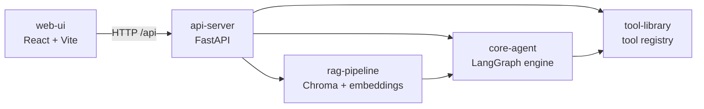

# Agent Orchestration

A tool-calling AI agent service that combines **LangGraph** orchestration, **RAG** over a vector store, and a set of built-in tools (web fetch, email, knowledge-base query), exposed via a **FastAPI** backend and a **React** dashboard.

The orchestrator runs an LLM in a tool-calling loop: it decides which tool to invoke (RAG, web, or email), executes it, feeds the result back, and repeats until the model produces a final answer or the iteration cap is reached.

## Architecture



| Package | Path | Purpose |
| --- | --- | --- |
| `core-agent` | `packages/core-agent` | Agent abstractions (`BaseAgent`, `AgentConfig`, `AgentResult`), the LangGraph orchestration graph with a tool-calling loop, and the `OrchestratorSettings` config |
| `rag-pipeline` | `packages/rag-pipeline` | Document loading (PDF, text), chunking, OpenAI embeddings, Chroma vector store, and retrieval-augmented generation |
| `tool-library` | `packages/tool-library` | Reusable tool abstractions (`BaseTool`, `ToolConfig`, `ToolResult`), a tool registry, and built-in tools: `WebSurfTool`, `EmailTool`, `RAGTool` |
| `api-server` | `packages/api-server` | FastAPI app exposing `/agents` (run, stream) and `/rag` (query, ingest) endpoints, with lifespan-managed registries and pipeline |
| `web-ui` | `web-ui` | React + Vite dashboard for running agents and querying RAG |

## Built-in Tools

The orchestrator has three tools wired in by default:

| Tool | Name | What it does |
| --- | --- | --- |
| `WebSurfTool` | `web_surf` | Fetches a URL with `httpx`, strips HTML/script/style tags, and returns truncated plain text |
| `EmailTool` | `send_email` | Sends an email via SMTP with STARTTLS, using credentials from `OrchestratorSettings` |
| `RAGTool` | `rag_query` | POSTs a question to the local `/rag/query` endpoint and returns the answer; falls back gracefully if the RAG service is unreachable |

Tools are wrapped as LangChain `StructuredTool` instances via `tool_to_langchain()` in `core_agent/tool_adapter.py`, then bound to the LLM with `bind_tools()`.

## Orchestration Loop

The `build_orchestrator_graph()` function in `core_agent/graph.py` compiles a LangGraph `StateGraph` with:

- **`orchestrator` node** — calls the LLM (OpenRouter-compatible `ChatOpenAI`) with the conversation and bound tools; injects a system prompt on the first turn
- **`tools` node** — a LangGraph `ToolNode` that executes any tool calls the LLM emitted
- **Conditional edge** — `should_continue()` routes back to `tools` if the LLM made tool calls, or to `END` if it produced a final answer or hit `MAX_TOOL_ITERATIONS`

State is tracked in `OrchestratorState` (messages, iterations, tool outputs, error).

## Prerequisites

- Python **3.11+**
- [Poetry](https://python-poetry.org/) **1.8+**
- Node.js **18+** (for the web UI)
- An **OpenRouter** API key (or any OpenAI-compatible endpoint) set as `OPENROUTER_API_KEY`
- An **OpenAI** API key for embeddings (`OPENAI_API_KEY`) if using the default RAG pipeline

## Configuration

All settings are loaded from environment variables (or a `.env` file) via `OrchestratorSettings` in `core_agent/settings.py`:

| Variable | Default | Purpose |
| --- | --- | --- |
| `OPENROUTER_API_KEY` | `""` | API key for the LLM endpoint |
| `OPENROUTER_BASE_URL` | `https://openrouter.ai/api/v1` | LLM endpoint base URL |
| `ORCHESTRATOR_MODEL` | `openai/gpt-4o-mini` | Model identifier |
| `ORCHESTRATOR_TEMPERATURE` | `0.7` | Sampling temperature |
| `ORCHESTRATOR_MAX_TOKENS` | `4096` | Max output tokens |
| `SMTP_HOST` / `SMTP_PORT` | `localhost` / `587` | SMTP server for `EmailTool` |
| `SMTP_USERNAME` / `SMTP_PASSWORD` | `""` | SMTP credentials |
| `SMTP_FROM_EMAIL` | `""` | Default sender address |
| `MAX_TOOL_ITERATIONS` | `10` | Cap on tool-calling loop iterations |

## Getting Started

```bash
# 1. Install Python dependencies (workspace-aware) and npm deps
make install

# 2. Configure your environment
cp .env.example .env  # then fill in OPENROUTER_API_KEY, OPENAI_API_KEY, SMTP_*

# 3. Start the API server (http://localhost:8000)
make run-api

# 4. In another terminal, start the web UI (http://localhost:5173)
make run-web
```

The Vite dev server proxies `/api/*` to `http://localhost:8000`, so no CORS setup is needed during development.

## Makefile Targets

| Target | Description |
| --- | --- |
| `make install` | Install Python deps via Poetry and npm deps for the web UI |
| `make lint` | Run `ruff` and `mypy` across the packages |
| `make test` | Run the pytest suite |
| `make build` | Build Python wheels and the web UI production bundle |
| `make run-api` | Start the FastAPI server with auto-reload on port 8000 |
| `make run-web` | Start the Vite dev server on port 5173 |
| `make precommit` | Run lint + test together |
| `make clean` | Remove caches, build artifacts, and `node_modules` |

## API Overview

### Agents

| Method | Path | Description |
| --- | --- | --- |
| `GET` | `/agents` | List registered agents |
| `POST` | `/agents/{name}/run` | Run an agent by name |
| `POST` | `/agents/{name}/stream` | Stream agent output via SSE |

### RAG

| Method | Path | Description |
| --- | --- | --- |
| `POST` | `/rag/query` | Query the RAG pipeline |
| `POST` | `/rag/ingest` | Ingest a document into the vector store |

Interactive docs are available at `http://localhost:8000/docs` (Swagger UI) and `http://localhost:8000/redoc`.

## Project Layout

```
agent-orchestration/
├── Makefile
├── pyproject.toml            # Poetry workspace root
├── packages/
│   ├── core-agent/
│   │   ├── core_agent/
│   │   │   ├── base.py       # BaseAgent, AgentConfig, AgentResult
│   │   │   ├── graph.py      # LangGraph orchestration (tool-calling loop)
│   │   │   ├── registry.py   # AgentRegistry
│   │   │   ├── settings.py   # OrchestratorSettings (env-based config)
│   │   │   └── tool_adapter.py  # BaseTool → LangChain StructuredTool
│   │   └── tests/
│   ├── rag-pipeline/
│   │   ├── rag_pipeline/
│   │   │   ├── pipeline.py   # RAGPipeline (ingest, retrieve, query)
│   │   │   └── retriever.py  # VectorRetriever (Chroma + OpenAI embeddings)
│   │   └── tests/
│   ├── tool-library/
│   │   ├── tool_library/
│   │   │   ├── base.py       # BaseTool, ToolConfig, ToolResult
│   │   │   ├── registry.py   # ToolRegistry
│   │   │   └── tools/        # web_tool, email_tool, rag_tool
│   │   └── tests/
│   └── api-server/
│       ├── api_server/
│       │   ├── main.py       # FastAPI app + lifespan
│       │   └── routes/       # agents.py, rag.py
│       └── tests/
└── web-ui/
    ├── src/
    │   ├── App.tsx
    │   ├── main.tsx
    │   └── index.css
    ├── index.html
    ├── package.json
    ├── tsconfig.json
    └── vite.config.ts
```

## Extending

### Adding a new agent

1. Subclass `BaseAgent` from `core_agent.base` and implement `run()` and `stream()`.
2. Register it with `AgentRegistry.register(name, AgentClass)`.
3. Expose it via the `/agents` routes in `api_server`.

### Adding a new tool

1. Subclass `BaseTool` from `tool_library.base` and implement `run()`.
2. Register it with `ToolRegistry.register(name, ToolClass)`.
3. Add the tool to `build_langchain_tools()` in `core_agent/tool_adapter.py` so the orchestrator can bind it.

### Code style

- **Ruff** for linting and import sorting (line length 100).
- **mypy** in strict mode.
- **pytest** with `pytest-asyncio` in auto mode.

Run everything before committing:

```bash
make precommit
```

## License

MIT
