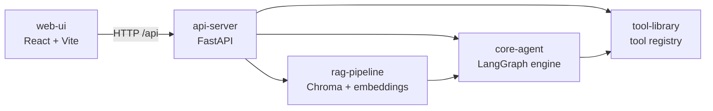

# Agent Orchestration

A learning-focused agent orchestration service built with **LangChain**, **LangGraph**, and **RAG**, structured as a Poetry workspace with a React front end.

## Architecture



| Package | Path | Purpose |
| --- | --- | --- |
| `core-agent` | `packages/core-agent` | Agent abstractions (`BaseAgent`, `AgentConfig`, `AgentResult`) and the LangGraph orchestration graph |
| `rag-pipeline` | `packages/rag-pipeline` | Document loading, chunking, embedding, and hybrid retrieval over a vector store |
| `tool-library` | `packages/tool-library` | Reusable tool abstractions (`BaseTool`, `ToolConfig`, `ToolResult`) and a tool registry |
| `api-server` | `packages/api-server` | FastAPI app exposing `/agents` and `/rag` endpoints |
| `web-ui` | `web-ui` | React + Vite dashboard for running agents and querying RAG |

## Prerequisites

- Python **3.11+**
- [Poetry](https://python-poetry.org/) **1.8+**
- Node.js **18+** (for the web UI)

## Getting Started

```bash
# 1. Install Python dependencies (workspace-aware)
make install

# 2. Start the API server (http://localhost:8000)
make run-api

# 3. In another terminal, start the web UI (http://localhost:5173)
make run-web
```

The Vite dev server proxies `/api/*` to `http://localhost:8000`, so no CORS setup is needed during development.

## Makefile Targets

| Target | Description |
| --- | --- |
| `make install` | Install Python deps via Poetry and npm deps for the web UI |
| `make lint` | Run `ruff` and `mypy` across the packages |
| `make test` | Run the pytest suite |
| `make build` | Build Python wheels and the web UI production bundle |
| `make run-api` | Start the FastAPI server with auto-reload on port 8000 |
| `make run-web` | Start the Vite dev server on port 5173 |
| `make precommit` | Run lint + test together |
| `make clean` | Remove caches, build artifacts, and `node_modules` |

## API Overview

### Agents

| Method | Path | Description |
| --- | --- | --- |
| `GET` | `/agents` | List registered agents |
| `POST` | `/agents/{name}/run` | Run an agent by name |
| `POST` | `/agents/{name}/stream` | Stream agent output via SSE |

### RAG

| Method | Path | Description |
| --- | --- | --- |
| `POST` | `/rag/query` | Query the RAG pipeline |
| `POST` | `/rag/ingest` | Ingest a document into the vector store |

Interactive docs are available at `http://localhost:8000/docs` (Swagger UI) and `http://localhost:8000/redoc`.

## Project Layout

```
agent-orchestration/
├── Makefile
├── pyproject.toml            # Poetry workspace root
├── packages/
│   ├── core-agent/
│   │   ├── core_agent/
│   │   │   ├── base.py       # BaseAgent, AgentConfig, AgentResult
│   │   │   ├── graph.py      # LangGraph orchestration
│   │   │   └── registry.py   # AgentRegistry
│   │   └── tests/
│   ├── rag-pipeline/
│   │   ├── rag_pipeline/
│   │   │   ├── pipeline.py   # Chunk, RetrievalResult, pipeline
│   │   │   └── retriever.py  # VectorRetriever
│   │   └── tests/
│   ├── tool-library/
│   │   ├── tool_library/
│   │   │   ├── base.py       # BaseTool, ToolConfig, ToolResult
│   │   │   └── registry.py   # ToolRegistry
│   │   └── tests/
│   └── api-server/
│       ├── api_server/
│       │   ├── main.py       # FastAPI app + lifespan
│       │   └── routes/       # agents.py, rag.py
│       └── tests/
└── web-ui/
    ├── src/
    │   ├── App.tsx
    │   ├── main.tsx
    │   └── index.css
    ├── index.html
    ├── package.json
    ├── tsconfig.json
    └── vite.config.ts
```

## Development

### Adding a new agent

1. Subclass `BaseAgent` from `core_agent.base` and implement `run()` and `stream()`.
2. Register it with `AgentRegistry.register(name, AgentClass)`.
3. Expose it via the `/agents` routes in `api_server`.

### Adding a new tool

1. Subclass `BaseTool` from `tool_library.base` and implement `run()`.
2. Register it with `ToolRegistry.register(name, ToolClass)`.
3. Reference the tool name in an `AgentConfig.tools` list.

### Code style

- **Ruff** for linting and import sorting (line length 100).
- **mypy** in strict mode.
- **pytest** with `pytest-asyncio` in auto mode.

Run everything before committing:

```bash
make precommit
```

## License

MIT
